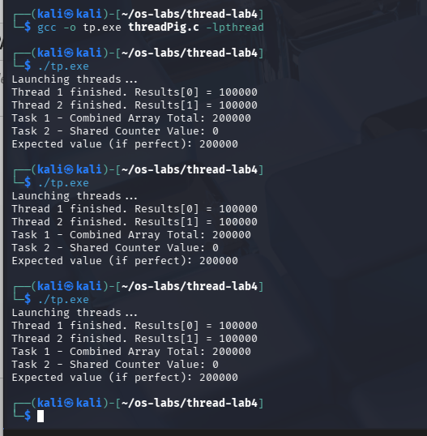
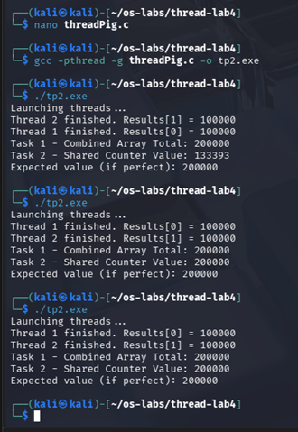
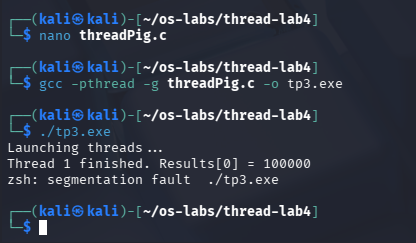
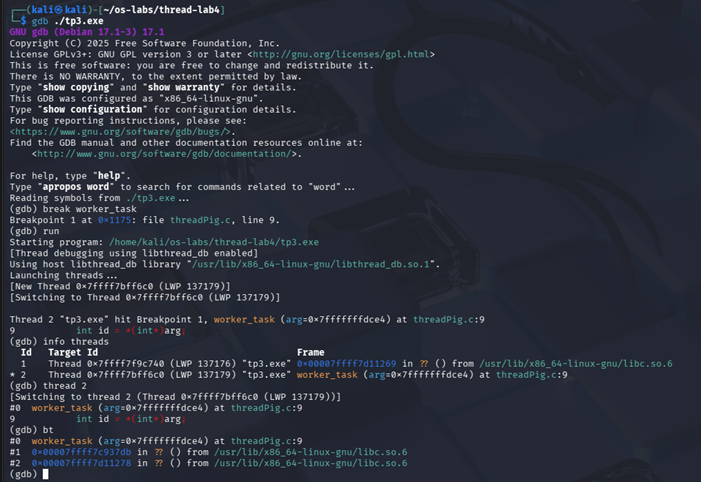
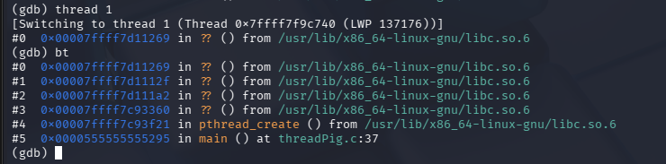

# Multithreading Debugging with GDB (Linux)

This project demonstrates:
1) Two threads working safely when they don’t fight over the same data  
2) A race condition when threads share a variable without protection  
3) How one thread crash (`SIGSEGV`) can take down the whole process — and how to inspect it in GDB

## What’s inside
- `src/thread_task1.c` — safe updates (each thread writes to its own slot)
- `src/thread_task2_race.c` — race condition on a shared counter (results vary run-to-run)
- `src/thread_task3_crash.c` — intentional crash to practice debugging threads in GDB

## Build & run
```bash
gcc -pthread -g src/thread_task1.c -o tp1
./tp1

gcc -pthread -g src/thread_task2_race.c -o tp2
./tp2

gcc -pthread -g src/thread_task3_crash.c -o tp3
./tp3
```
## Screenshots

### Baseline run (Task 1 output)


### Race condition (shared counter varies run-to-run)


### Crash (SIGSEGV)


### GDB: threads + backtrace


### GDB: thread 1 backtrace

